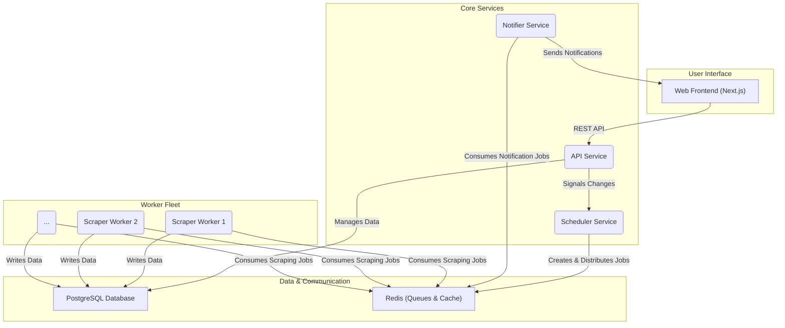

# Architecture

DealScrapper is built on a microservices architecture, designed for scalability, resilience, and maintainability. Each service has a distinct responsibility, and they communicate asynchronously via a central Redis message broker.

## High-Level Overview



## Tech Stack

- **Backend Framework**: NestJS (TypeScript)
- **Frontend Framework**: Next.js 15 (TypeScript, React 19)
- **Database**: PostgreSQL with Prisma ORM
- **Job Queuing & Caching**: Redis with BullMQ
- **Containerization**: Docker & Docker Compose
- **Monorepo Management**: PNPM Workspaces & Turborepo

## Services

| Service | Port | Description | Documentation |
|---------|------|-------------|---------------|
| **Web Frontend** | 3000 | User interface for interacting with the platform | [README](./apps/web/) |
| **API Service** | 3001 | Main entry point — manages users, authentication, and filter rules | [README](./apps/api/) |
| **Scraper Worker** | 3002 | Horizontally scalable worker that executes scraping jobs with Puppeteer | [README](./apps/scraper/) |
| **Notifier Service** | 3003 | Delivers real-time notifications via WebSocket and email | [README](./apps/notifier/) |
| **Scheduler Service** | 3004 | Orchestrates scraping jobs, monitors workers, and optimizes URLs | [README](./apps/scheduler/) |

## Shared Packages

The monorepo includes shared packages that provide core functionality across all services:

| Package | Description |
|---------|-------------|
| **@dealscrapper/database** | Prisma schema, migrations, and database utilities |
| **@dealscrapper/shared-repository** | Base repository pattern with 80-95% code reuse |
| **@dealscrapper/shared-types** | Shared TypeScript types and interfaces |
| **@dealscrapper/shared-logging** | Winston-based logging service |
| **@dealscrapper/shared-health** | Health check utilities for all services |
| **@dealscrapper/shared-config** | Type-safe configuration validation |
| **@dealscrapper/shared** | Common utilities (error handling, retries, delays) |

For complete package documentation, see [packages/README.md](./packages/).

## Monorepo Structure

```
dealscrapper-v2/
├── apps/                          # Microservices
│   ├── web/                       # Frontend (Next.js 15)
│   ├── api/                       # REST API (NestJS)
│   ├── scraper/                   # Scraping workers (Puppeteer)
│   ├── notifier/                  # Notifications (Email/WebSocket)
│   └── scheduler/                 # Job orchestration
│
├── packages/                      # Shared packages
│   ├── database/                  # Prisma schema & migrations
│   ├── shared-types/              # TypeScript types & interfaces
│   ├── shared-repository/         # Base repository pattern
│   ├── shared-logging/            # Winston logger
│   ├── shared-config/             # Configuration validation
│   ├── shared-health/             # Health check utilities
│   └── shared/                    # Common utilities
│
├── docs/                          # Documentation
├── scripts/                       # CI/CD & utility scripts
└── docker-compose.yml             # Infrastructure config
```

## How It Works: The Lifecycle of a Scraping Job

1. **Job Creation** — The **Scheduler** creates a scraping job for a specific category (e.g., "graphics-cards").
2. **URL Optimization** — It analyzes all user filters for that category and generates an optimized URL (e.g., `...?price_max=500&temp_min=100`), reducing scraping load by 60-95%.
3. **Job Distribution** — The job is added to a **Redis** queue.
4. **Job Consumption** — An available **Scraper Worker** picks up the job.
5. **Execution** — The worker scrapes the optimized URL, extracts the deals, and processes them.
6. **Filtering & Persistence** — Deals are matched against user filters using advanced rule-based logic. Only relevant deals are saved to **PostgreSQL**.
7. **Notification** — If a deal matches a filter, a notification job is added to a Redis queue.
8. **Delivery** — The **Notifier Service** picks up the job and sends an alert via WebSocket or email.

## Multi-Site Architecture

DealsScrapper supports multiple deal sources with a unified data model:

```
┌─────────────────────────────────────────────────────────────┐
│                    MULTI-SITE ARCHITECTURE                   │
├─────────────────────────────────────────────────────────────┤
│                                                              │
│  SiteSource Enum ──► Site Definition ──► Site Adapter       │
│       │                    │                   │             │
│       │                    ▼                   ▼             │
│       │              Auto-syncs to       Handles HTML        │
│       │              Database Site       extraction          │
│       │                                                      │
│       ▼                                                      │
│  ┌─────────────────────────────────────────────────────┐    │
│  │                   Article (Base)                     │    │
│  │  id, title, price, url, imageUrl, siteId, etc.      │    │
│  └──────────────────────┬──────────────────────────────┘    │
│                         │                                    │
│     ┌───────────────────┼───────────────────┐               │
│     ▼                   ▼                   ▼               │
│  ArticleDealabs    ArticleVinted    ArticleLeBonCoin        │
│  (temperature,     (brand, size,    (city, region,          │
│   commentCount)     condition)       proSeller)             │
│                                                              │
│  ┌─────────────────────────────────────────────────────┐    │
│  │                  ArticleWrapper                      │    │
│  │  Unified access: wrapper.getExtension()              │    │
│  │  Type-safe access to site-specific data              │    │
│  └─────────────────────────────────────────────────────┘    │
└─────────────────────────────────────────────────────────────┘
```

**Key Principles:**
- **Single Source of Truth**: Site config in `SITE_DEFINITIONS` auto-syncs to database
- **Type Safety**: Each site has a typed extension interface
- **Unified Access**: `ArticleWrapper` provides a consistent API across all sites
- **Category-Based Sites**: Sites derived from `Category.siteId`, not stored on Filter

For more details on adding a new site, see [ADDING_NEW_SITE.md](./ADDING_NEW_SITE.md).
