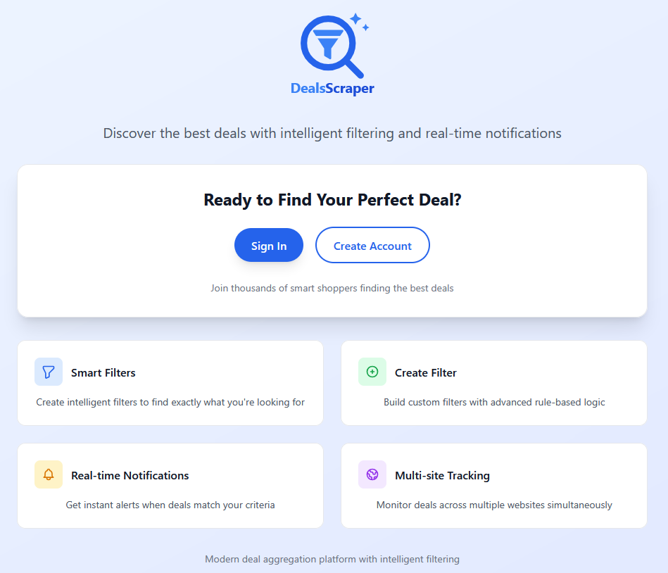
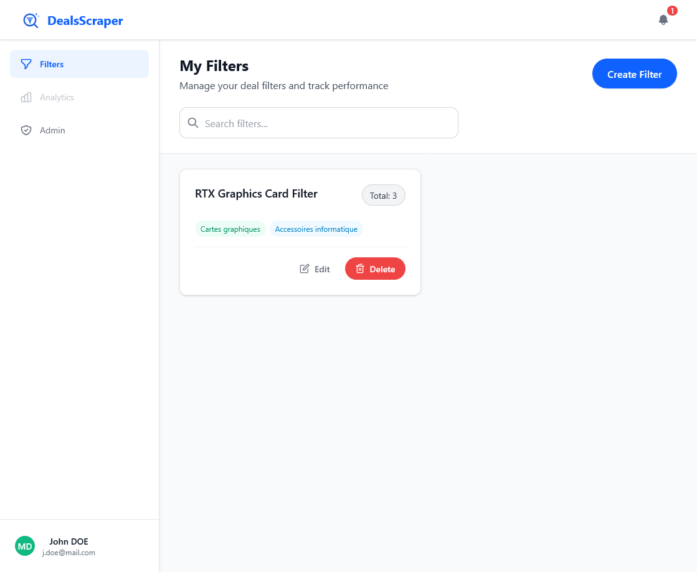
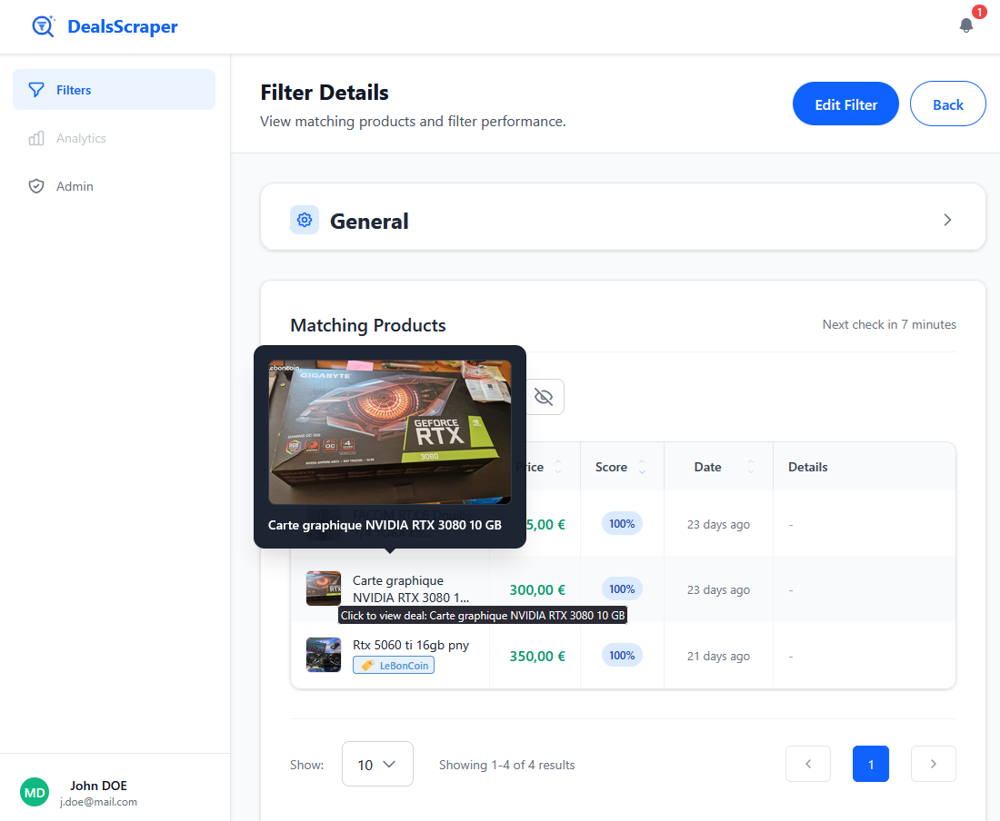
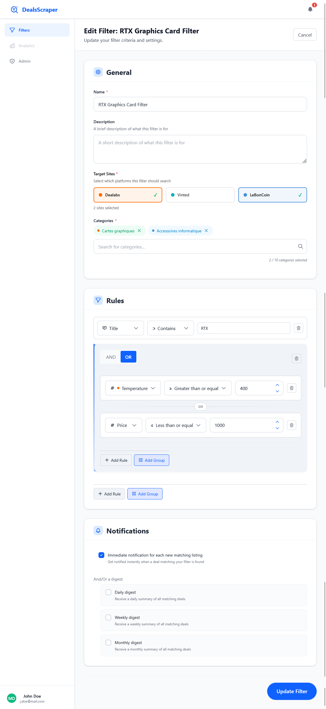
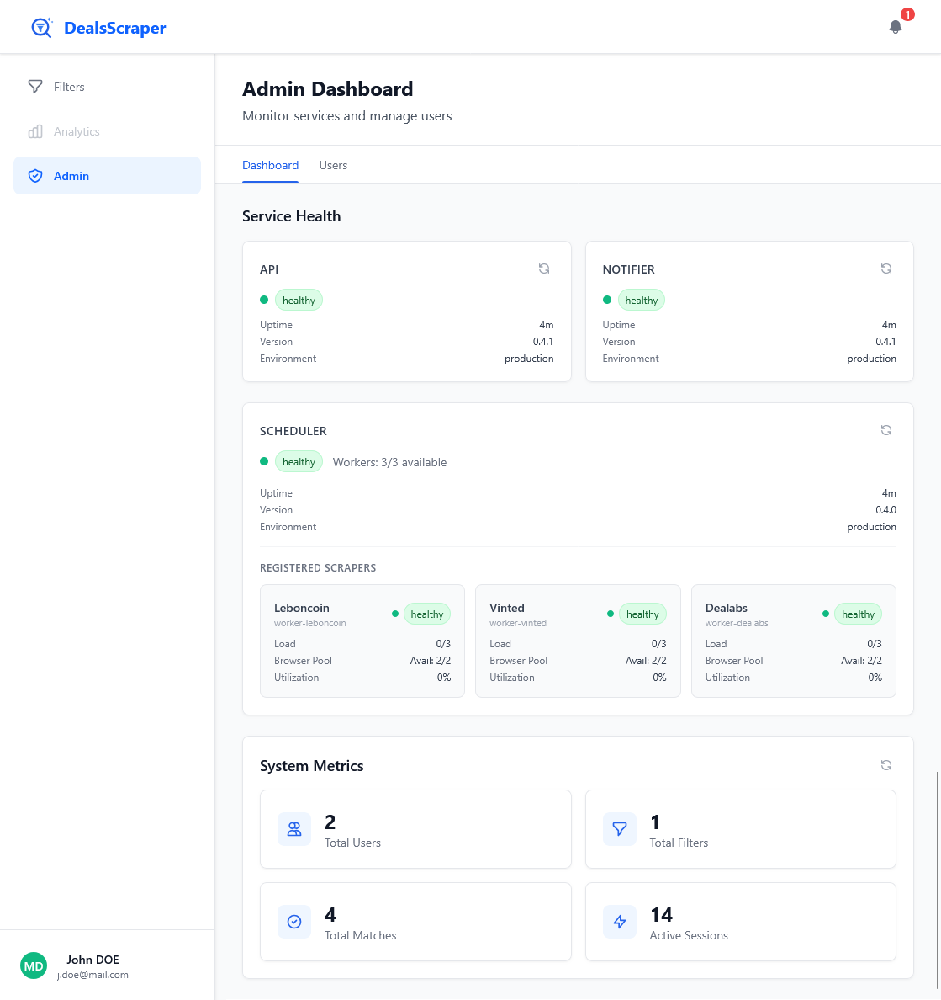

# DealScrapper

[](https://github.com/Pekno/DealsScrapper-V2/actions/workflows/pr-tests.yml)
[](https://github.com/Pekno/DealsScrapper-V2/actions/workflows/version-release.yml)
[](https://opensource.org/licenses/MIT)
[](https://www.anthropic.com)

**Services:**
[](apps/api/package.json)
[](apps/web/package.json)
[](apps/scraper/package.json)
[](apps/notifier/package.json)
[](apps/scheduler/package.json)

**Stack:**


A self-hosted deal aggregation platform that automatically scrapes, filters, and notifies you about the best deals from across the web — so you never miss a good one.

<p align="center">
  
</p>

## Why?

Manually checking deal sites like Dealabs, Vinted, or LeBonCoin multiple times a day is tedious and unreliable. You either miss the best deals because you weren't looking at the right time, or you waste hours refreshing pages.

DealScrapper solves this by running in the background, continuously scanning your favorite deal sources and alerting you instantly when something matches your criteria — whether that's a GPU under 300 EUR with a temperature above 100, or a specific brand on Vinted below a certain price.

### Built entirely by AI

This project was built as an experiment in AI-assisted development. **100% of the code was generated by Claude** (Anthropic's AI assistant). The human role was focused on architecture decisions, system design, product direction, and code review — not implementation. Every line of code, every test, every configuration file was written by Claude, guided by human vision and architectural choices.

## Features

- **Multi-site support** — Aggregate deals from Dealabs, Vinted, LeBonCoin, and more
- **Smart filtering** — Create complex filters with AND/OR logic, regex, price ranges, and site-specific fields (temperature, brand, condition, etc.)
- **Real-time notifications** — Get instant alerts via email or WebSocket the moment a deal matches
- **Adaptive scheduling** — Scraping frequency adjusts automatically based on demand
- **URL optimization** — Pre-filters at the source level, reducing scraping load by 60-95%
- **Horizontally scalable** — Spin up as many scraper workers as you need
- **Self-hosted** — Your data, your rules, your infrastructure

## Screenshots

<table>
  <tr>
    <td align="center" width="33%">
      <a href="screenshots/frontpage.png">
        <br/>
        <sub><b>Landing Page</b></sub>
      </a><br/>
      <sub>The public-facing home page</sub>
    </td>
    <td align="center" width="33%">
      <a href="screenshots/filters.png">
        <br/>
        <sub><b>Filters Overview</b></sub>
      </a><br/>
      <sub>All your filters at a glance</sub>
    </td>
    <td align="center" width="33%">
      <a href="screenshots/matches.png">
        <br/>
        <sub><b>Filter Matches</b></sub>
      </a><br/>
      <sub>Deals matched by a filter in real time</sub>
    </td>
  </tr>
  <tr>
    <td align="center" width="33%">
      <a href="screenshots/filter.png">
        <br/>
        <sub><b>Filter Builder</b></sub>
      </a><br/>
      <sub>Create rules with AND/OR logic, regex, price ranges</sub>
    </td>
    <td align="center" width="33%">
      <a href="screenshots/admin.png">
        <br/>
        <sub><b>Admin Dashboard</b></sub>
      </a><br/>
      <sub>Monitor all services, workers, and system health</sub>
    </td>
    <td align="center" width="33%"></td>
  </tr>
</table>

## Deploy

### Prerequisites

- **Docker** & **Docker Compose** (or a container management tool like [Portainer](https://www.portainer.io/))

That's it. No Node.js, no build tools — everything runs from pre-built Docker images.

### Option 1: Docker Compose (recommended)

1. **Download the two files you need:**

   ```bash
   mkdir dealscrapper && cd dealscrapper

   # Download the production compose file
   curl -O https://raw.githubusercontent.com/Pekno/DealsScrapper-V2/main/docker-compose.prod.yml

   # Download the environment template
   curl -O https://raw.githubusercontent.com/Pekno/DealsScrapper-V2/main/.env.example
   cp .env.example .env
   ```

2. **Edit `.env`** with your settings:

   ```bash
   # Required — generate secrets with: openssl rand -hex 32
   PUBLIC_HOST=localhost              # or your server IP (e.g., 192.168.1.200)
   POSTGRES_USER=dealscrapper
   POSTGRES_PASSWORD=<strong-password>
   POSTGRES_DB=dealscrapper
   JWT_SECRET=<generated-secret>
   JWT_REFRESH_SECRET=<generated-secret>
   EMAIL_VERIFICATION_SECRET=<generated-secret>

   # Email notifications — optional, disabled if not set
   # Uncomment and fill in ONE of the blocks below to enable email alerts

   # Option A: Gmail OAuth2
   # EMAIL_PROVIDER=gmail
   # GMAIL_CLIENT_ID=<your-client-id>
   # GMAIL_CLIENT_SECRET=<your-client-secret>
   # GMAIL_REFRESH_TOKEN=<your-refresh-token>
   # GMAIL_USER_EMAIL=<your-gmail@gmail.com>

   # Option B: Resend (simpler — just an API key)
   # EMAIL_PROVIDER=resend
   # RESEND_API_KEY=re_<your-api-key>

   # Option C: MailHog (local testing only)
   # EMAIL_PROVIDER=mailhog
   ```

   Email setup guides: [Gmail OAuth2](./docs/GMAIL_OAUTH2_SETUP.md) · [Resend](./docs/RESEND_SETUP.md)

3. **Start the stack:**

   ```bash
   docker compose -f docker-compose.prod.yml up -d
   ```

   This pulls all images and starts the full platform: PostgreSQL, Redis, Elasticsearch, API, Web UI, Scheduler, Notifier, and one scraper per supported site.

4. **Access the platform:**

   | Service | URL |
   |---------|-----|
   | Web UI | `http://<PUBLIC_HOST>:3000` |
   | API Docs (Swagger) | `http://<PUBLIC_HOST>:3001/api/docs` |

### Option 2: Portainer Stack

1. In Portainer, go to **Stacks > Add stack**
2. Upload or paste the contents of [`docker-compose.prod.yml`](./docker-compose.prod.yml)
3. Under **Environment variables**, add the required variables listed above
4. Click **Deploy the stack**

### Configuration Reference

Only the variables below are required. Everything else has sensible defaults in the compose file.

| Variable | Description |
|----------|-------------|
| `PUBLIC_HOST` | IP or hostname where the platform is accessible from browsers |
| `POSTGRES_PASSWORD` | Database password |
| `JWT_SECRET` | Secret for JWT authentication tokens |
| `JWT_REFRESH_SECRET` | Secret for refresh tokens |
| `EMAIL_VERIFICATION_SECRET` | Secret for email verification links |
| `EMAIL_PROVIDER` | Email backend: `gmail`, `resend`, or `mailhog` — **optional**, omit to disable email notifications entirely |
| `GMAIL_*` | Gmail OAuth2 credentials — required when `EMAIL_PROVIDER=gmail` |
| `RESEND_API_KEY` | Resend API key — required when `EMAIL_PROVIDER=resend` |

For the full list of optional overrides, see [`.env.example`](./.env.example).

## How It Works

1. You create **filters** describing what deals you're looking for (keywords, price range, site-specific criteria)
2. The **scheduler** continuously creates scraping jobs optimized for your filters
3. **Scraper workers** fetch deals from the source sites
4. Deals are **matched against your filters** using a rule-based scoring engine
5. When a match is found, you get a **notification** instantly via email or WebSocket

For the full technical architecture, see [ARCHITECTURE.md](./ARCHITECTURE.md).

## Documentation

| Document | Description |
|----------|-------------|
| [Architecture](./ARCHITECTURE.md) | System design, tech stack, service overview, data flow |
| [Development Guide](./DEVELOPMENT.md) | Setup, workflow, testing, and code quality for contributors |
| [Adding a New Site](./ADDING_NEW_SITE.md) | Step-by-step guide to integrate a new deal source |
| [Commands Reference](./COMMANDS.md) | All available CLI commands |
| [E2E Testing Guide](./test/E2E-TESTING-GUIDE.md) | End-to-end testing setup and test scenarios |
| [Future Features](./FUTURE_FEATURES.md) | Planned features and roadmap |
| [Production Deployment](./docs/PRODUCTION_DEPLOYMENT.md) | Production deployment guide |
| [Docker Guide](./docs/DOCKER.md) | Docker image builds, Compose setup, and container management |
| [CI/CD](./docs/CI_CD.md) | Continuous integration and deployment pipeline |
| [Release Process](./docs/RELEASE_PROCESS.md) | Versioning, changelog, and release workflow |
| [Gmail OAuth2 Setup](./docs/GMAIL_OAUTH2_SETUP.md) | Email notifications via Gmail OAuth2 |
| [Resend Setup](./docs/RESEND_SETUP.md) | Email notifications via Resend API |

## Tech Stack

Built with a modern, production-grade stack:

- **Next.js 15** / React 19 — Frontend
- **NestJS** — Backend microservices
- **PostgreSQL** + Prisma — Database
- **Redis** + BullMQ — Job queues
- **Puppeteer** — Web scraping
- **Docker** — Containerization
- **TypeScript** — End-to-end type safety

## Contributing

Contributions are welcome! See the [Development Guide](./DEVELOPMENT.md) to get started.

## License

This project is licensed under the MIT License.
