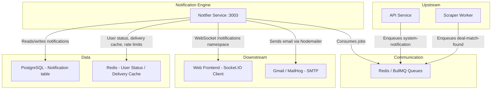

# Notifier Service - Multi-Channel Notification Delivery Engine

## Overview

The Notifier Service is the **notification delivery backbone** of DealsScapper. It receives notification jobs via BullMQ queues, evaluates user preferences and channel health, then delivers notifications through WebSocket (real-time in-app) and Email (Gmail OAuth2 or MailHog for testing). Every delivery is tracked with retry logic, and a daily cron job handles cleanup of old notification records.

**Key Responsibilities:**
- **Multi-Channel Delivery** - Routes notifications to WebSocket and/or Email based on user status and preferences
- **BullMQ Queue Processing** - Consumes `deal-match-found`, `system-notification`, and `retry-notification` jobs
- **Unified Notification Payload** - Builds a single payload structure stored in the database and sent across all channels
- **Delivery Tracking** - Records every attempt per channel with exponential backoff retries (1min, 5min, 15min)
- **User Preference Enforcement** - Checks quiet hours, category toggles, score thresholds, blocked keywords, and daily limits
- **Channel Health Monitoring** - Periodic health checks (every 5 minutes) with degraded/fallback routing for high-priority notifications
- **Security** - Rate limiting on WebSocket connections and messages, IP blacklisting, abuse detection scoring

## Architecture

### Service Interactions



### Directory Structure

```
apps/notifier/
├── src/
│   ├── auth/                  # JWT authentication guard and CurrentUser decorator
│   ├── channels/              # Email delivery channel (Nodemailer + Gmail OAuth2 / MailHog)
│   ├── config/                # Logging configuration (Winston daily rotate)
│   ├── health/                # Custom health service with WebSocket, delivery, and channel checks
│   ├── jobs/                  # Scheduled cleanup job (daily at 2 AM UTC) and cleanup controller
│   ├── notifications/         # REST API controllers for notification CRUD and email tracking pixel
│   ├── processors/            # BullMQ queue processor for deal-match, system, and retry jobs
│   ├── repositories/          # Notification and delivery tracking repositories (Prisma)
│   ├── services/              # Core business services (delivery tracking, preferences, rate limiting, etc.)
│   ├── templates/             # Handlebars + MJML email template engine with XSS sanitization
│   ├── utils/                 # Error handling, JSON deserialization, Redis helpers, URL sanitization
│   ├── websocket/             # Socket.IO gateway with JWT auth, heartbeats, and activity tracking
│   ├── main.ts                # Bootstrap: NestJS app, Swagger, CORS, ValidationPipe
│   └── notifier.module.ts     # Root module wiring all sub-modules
└── test/
    └── unit/                  # Unit tests for services, controllers, processors, and security
```

---

## Internal Services

### NotificationProcessor (`processors/notification.processor.ts`)

The core BullMQ processor that consumes jobs from the `notifications` queue. It handles three job types: `deal-match-found`, `system-notification`, and `retry-notification`. For each deal match, it fetches the user's real-time status from Redis via `UserStatusService`, evaluates notification permissions through `NotificationPreferencesService`, intersects preferred channels with healthy channels from `ChannelHealthService`, then builds a `UnifiedNotificationPayload` containing deal data, site-specific fields, and metadata. The payload is persisted once via `DeliveryTrackingService.createDelivery()` and then delivered to selected channels. Failed deliveries are automatically retried via `scheduleRetry()` with a 1-minute initial delay.

**Key behaviors:**
- Processes `deal-match-found` jobs with full preference/health evaluation pipeline
- Processes `system-notification` jobs with urgency-based channel selection (high priority uses both channels)
- Processes `retry-notification` jobs by re-attempting failed deliveries
- Builds `UnifiedNotificationPayload` with site-specific fields (`brand`, `city`, `sellerName`) nested under `data.dealData.siteSpecific`
- Intersects user-preferred channels with health-recommended channels; falls back to health recommendations for high-priority jobs
- Records delivery attempts per channel and schedules retries on total failure
- Queue event handlers log job lifecycle (`OnQueueActive`, `OnQueueCompleted`, `OnQueueFailed`, `OnQueueError`)
- Default job options: 3 attempts, exponential backoff starting at 2 seconds, keeps last 100 completed and 50 failed jobs

**Depends on:** `NotificationGateway`, `UserStatusService`, `NotificationPreferencesService`, `DeliveryTrackingService`, `EmailService`, `TemplateService`, `ChannelHealthService`, `PrismaService`

---

### NotificationGateway (`websocket/notification.gateway.ts`)

The Socket.IO WebSocket gateway mounted at the `/notifications` namespace. It authenticates clients via JWT tokens extracted from the `Authorization` header, query parameters, or the Socket.IO `auth` object. On connection, it enforces rate limiting on IP addresses, checks blacklist status, verifies user existence in the database, and limits concurrent connections to 3 per user. Existing connections for the same user are replaced (notified with a `replaced` event). A 30-second heartbeat interval keeps connections alive. The gateway tracks all active connections in an in-memory `Map<string, UserConnection>` and synchronizes online/offline status to Redis via `UserStatusService`.

**Key behaviors:**
- JWT authentication with support for both `userId` and `sub` claims
- Connection rate limiting via `RateLimitingService.checkConnectionRateLimit()` with IP blacklist check
- Maximum 3 connections per user; oldest connection replaced on excess
- 30-second server-to-client heartbeat interval
- `sendToUser(userId, payload)` sends unified notification payloads to user-specific rooms (`user-{userId}`)
- Subscribes to `activity`, `inactive`, `page_hidden`, `page_visible`, `heartbeat`, `update_preferences`, `get_preferences`, `get_activity_stats` messages
- Message rate limiting: 100 messages per minute per user
- Device type detection (web/mobile) from User-Agent header
- Sends user notification preferences on connection and missed notifications on reconnection
- CORS origins configured from `WEB_APP_URL` environment variable

**Depends on:** `JwtService`, `UserStatusService`, `ActivityTrackingService`, `RateLimitingService`, `NotificationPreferencesService`, `DeliveryTrackingService`, `EmailService`, `PrismaService`, `SharedConfigService`

---

### EmailService (`channels/email.service.ts`)

Handles email delivery through two modes: **Gmail OAuth2** for production and **MailHog** for test environments. The mode is determined by `SharedConfigService.getEmailConfig().service`. In production, it creates a Google OAuth2 client, refreshes access tokens, and sends via Gmail SMTP. Templates are rendered using Handlebars with MJML for responsive HTML and DOMPurify for XSS sanitization. Each email includes UTM tracking parameters and an optional tracking pixel (`/track/email/{notificationId}/open.png`). Custom headers (`X-Template`, `X-Priority`, `X-User-ID`, `X-Mailer`) are attached for debugging.

**Key behaviors:**
- Dual mode: `gmail` (OAuth2 with refresh token) or `mailhog` (plain SMTP for testing)
- Template rendering via Handlebars with MJML compilation to responsive HTML
- DOMPurify sanitization of all template data to prevent XSS
- URL sanitization blocking dangerous protocols (`javascript:`, `data:`, `vbscript:`)
- UTM parameter injection for link tracking
- Email tracking pixel for open detection
- `sendDealMatchEmail()`, `sendEmail()` methods with priority mapping
- `getProviderStatus()` for health checks (configured, healthy, provider name)
- Input validation on all email options before processing

**Depends on:** `NODEMAILER_TRANSPORT` (injected transporter), `SharedConfigService`

---

### DeliveryTrackingService (`services/delivery-tracking.service.ts`)

The central persistence and tracking layer for all notification deliveries. When a notification is processed, `createDelivery()` generates a unique delivery ID, stores the full `NotificationDelivery` record in Redis (7-day TTL) for fast access, and creates a corresponding row in the PostgreSQL `Notification` table with the unified payload serialized in the `content` field. Each channel attempt is recorded via `recordAttempt()`, which updates both Redis and database with delivery status, attempt count, and error details. After 3 failed attempts, the delivery is marked as permanently failed.

**Key behaviors:**
- Dual storage: Redis (fast access, 7-day TTL) + PostgreSQL (persistent)
- `createDelivery()` generates delivery ID, stores in both Redis and database
- `recordAttempt()` tracks per-channel success/failure with attempt numbering
- Exponential backoff retry scheduling: 1 minute, 5 minutes, 15 minutes
- `getFailedDeliveriesForRetry()` scans Redis using `SCAN` (not `KEYS`) for production safety
- `getUserDeliveryStats()` returns delivery rate metrics per user
- `getOverallStats()` provides system-wide delivery analytics with type breakdown
- `getNotifications()` returns paginated, unified-format notifications for the REST API
- `cleanupOldDeliveries()` removes records older than 7 days

**Depends on:** `REDIS_CLIENT` (ioredis), `PrismaService`

---

### NotificationPreferencesService (`services/notification-preferences.service.ts`)

Evaluates whether a notification should be sent to a given user and through which channels. It reads user preferences from the database (email toggle, weekly digest flag, email verification status, timezone) and constructs a full `NotificationPreferences` object with defaults for fields not yet in the schema. The `shouldSendNotification()` method performs a multi-step check: category enablement, frequency setting, daily limit, minimum score threshold, blocked keyword matching, quiet hours (with high-priority override), and priority-only mode. Channel selection considers whether the user is online (WebSocket) and whether email is verified.

**Key behaviors:**
- Builds preferences from User model fields: `emailNotifications`, `weeklyDigest`, `emailVerified`, `timezone`
- Category mapping: `deal-match` -> `dealMatch`, `digest` -> `digest`, `system`/`verification`/`welcome`/`reminder` -> `system`
- Quiet hours check with overnight wraparound support; high-priority notifications bypass quiet hours
- Blocked keyword matching (case-insensitive substring search)
- Minimum score threshold check (default: 50)
- Channel selection: WebSocket if online + inApp enabled; Email if verified + email enabled
- Daily limit check (deferred -- currently always allows; requires analytics table)
- `recordNotificationSent()` for analytics (deferred -- logs only)

**Depends on:** `PrismaService`

---

### RateLimitingService (`services/rate-limiting.service.ts`)

Redis-based rate limiting and abuse detection system protecting WebSocket connections and messages. Uses sorted sets with sliding windows for rate counting. Provides pre-configured limits: 10 connections per minute per IP, 100 messages per minute per user, 5 invalid token attempts per 5 minutes. Suspicious activity is scored (rapid connections: +2, excessive messages: +1, invalid auth: +3, geo anomaly: +2) and users exceeding the blacklist threshold (score >= 5) are auto-blacklisted for 1 hour.

**Key behaviors:**
- `checkConnectionRateLimit()`: 10 connections/minute per IP, 5-minute block on exceed
- `checkMessageRateLimit()`: 100 messages/minute per user, 1-minute block on exceed
- `checkAuthRateLimit()`: 5 invalid tokens per 5 minutes, 10-minute block on exceed
- `recordSuspiciousActivity()` with automatic abuse score evaluation
- Auto-blacklisting at score >= 5 (1-hour duration)
- Redis key sanitization preventing injection attacks (alphanumeric + `:._ -`, max 250 chars)
- Rate limit rule validation (limit <= 10,000, window <= 24 hours)
- Metadata sanitization: max 20 keys, max 500 chars per string value
- `getGlobalStats()` for monitoring dashboard (uses SCAN, not KEYS)
- Fail-open design: allows requests if Redis is unavailable

**Depends on:** `REDIS_CLIENT` (ioredis)

---

### UserStatusService (`services/user-status.service.ts`)

Manages real-time user online/active status in Redis. Each user's status includes online flag, active flag, last activity timestamp, device type, socket ID, and heartbeat timing. Status is stored with a 10-minute TTL for automatic cleanup of stale entries. Activity updates are debounced at 1 second to prevent Redis spam. Status changes are published to the `user_status_changes` Redis channel for cross-service consumption.

**Key behaviors:**
- `updateUserStatus()` stores status in Redis with 10-minute TTL and publishes to `user_status_changes` channel
- `getUserStatus()` / `getUserStatuses()` with pipeline-based batch retrieval
- `updateUserActivity()` debounced at 1 second to reduce Redis writes
- `getOnlineUsers()` scans all status keys (using SCAN) and filters online users
- `getDetailedStats()` includes heartbeat delay analysis and stale connection detection (2+ minutes)
- `trackConnectionAttempt()` records connection history in sorted sets (24-hour retention)
- Proper Date deserialization from Redis JSON strings

**Depends on:** `REDIS_CLIENT` (ioredis)

---

### ActivityTrackingService (`services/activity-tracking.service.ts`)

Records and analyzes fine-grained user activity events (mouse, keyboard, scroll, click, focus, blur, visibility changes) in Redis sorted sets. Maintains a rolling buffer of 1,000 events per user with a 7-day TTL. Provides activity pattern analysis including session grouping (5-minute gap threshold), peak activity detection (10+ events in 10 minutes), inactive period identification, and device breakdown. Computes engagement scores (0-100) based on activity variety, consistency, session length, and rate.

**Key behaviors:**
- `recordActivity()` stores events in Redis sorted sets, maintains 1,000-event buffer
- `analyzeActivityPattern()` with 1-hour cache TTL, computes sessions, peaks, and inactive periods
- `getUserEngagementScore()` returns 0-100 score based on variety, consistency, session length, and rate
- `getBatchEngagementScores()` processes multiple users in parallel via `Promise.allSettled`
- `getActivityHeatmap()` generates 24x7 hour/day grid for visualization
- Real-time activity indicators updated in Redis hashes with 5-minute expiry
- `cleanupOldActivities()` removes expired entries using SCAN

**Depends on:** `REDIS_CLIENT` (ioredis)

---

### ChannelHealthService (`services/channel-health.service.ts`)

Monitors the health of notification delivery channels (email and WebSocket) with periodic checks every 5 minutes and a 2-minute cache TTL. Determines overall system health as healthy, degraded, or unhealthy based on individual channel statuses. Provides channel recommendations considering user online status and notification priority -- high-priority notifications can fall back to degraded channels.

**Key behaviors:**
- Periodic health checks every 5 minutes via `setInterval`
- 2-minute health cache TTL to avoid redundant checks
- `getRecommendedChannels()` considers priority level and user online status
- High-priority notifications include degraded channels as fallbacks
- `isChannelAvailable()` for on-demand per-channel checks
- `getChannelMetrics()` for monitoring dashboard
- `refreshHealthStatus()` clears cache and forces fresh checks
- Proper cleanup via `OnModuleDestroy` lifecycle hook

**Depends on:** `EmailService`, `NotificationGateway`

---

### TemplateService (`templates/template.service.ts`)

Handlebars-based email template engine that renders notification content for different types (deal-match, system, digest, verification). Templates are compiled and cached in memory on service initialization. All template data is sanitized via `sanitizeInput()` and `sanitizeUrl()` before rendering. The service integrates with `SharedConfigService` for branding context (app name, logo URL, primary color, support email) injected into every template.

**Key behaviors:**
- Pre-compiled Handlebars templates stored in an in-memory `Map`
- Custom Handlebars helpers for formatting (prices, dates, percentages)
- XSS prevention via input sanitization before template rendering
- URL sanitization blocking dangerous protocols
- Branding context injection from environment configuration
- `getTemplateStats()` returns registered template count and names for health checks

**Depends on:** `SharedConfigService`

---

### NotificationCleanupJob (`jobs/notification-cleanup.job.ts`)

Scheduled cron job running daily at 2:00 AM UTC that cleans up old notification records from the database. It applies tiered retention: read notifications are deleted after 30 days, unread after 90 days. Additionally, it enforces a per-user limit of 1,000 notifications by deleting the oldest records for users exceeding the cap.

**Key behaviors:**
- Cron schedule: `0 2 * * *` (daily at 2 AM UTC)
- Read notifications: 30-day retention
- Unread notifications: 90-day retention
- Per-user limit: 1,000 notifications (oldest deleted first)
- `performCleanup()` available for manual invocation via REST endpoint
- `getCleanupPreview()` shows what would be deleted without executing
- `getSystemStats()` provides total counts, user counts, and date ranges

**Depends on:** `PrismaService`

---

### NotifierHealthService (`health/notifier-health.service.ts`)

Custom health service extending `BaseHealthService` from the shared health package. Registers four custom dependency checkers: WebSocket (connection stats + stale connection ratio), Email (provider status), Templates (compilation status), and Channels (overall channel health). The `getCustomHealthData()` method aggregates comprehensive monitoring data including WebSocket connections, user status stats, delivery metrics, security stats, and channel health into the `/health` endpoint response.

**Key behaviors:**
- Extends `BaseHealthService` with 4 custom health checkers
- WebSocket health: degraded if >30% stale connections
- Email health: checks provider configured + healthy status
- Template health: unhealthy if 0 templates, degraded if none registered
- Channel health: delegates to `ChannelHealthService.getChannelHealth()`
- Rich `/health` response with websocket, userStatus, delivery, security, and channels sections

**Depends on:** `NotificationGateway`, `UserStatusService`, `DeliveryTrackingService`, `RateLimitingService`, `EmailService`, `TemplateService`, `ChannelHealthService`, `SharedConfigService`

---

### NotificationsService (`notifications/notifications.service.ts`)

Thin service layer for the REST API that delegates notification retrieval to `DeliveryTrackingService.getNotifications()` and handles read/delete operations directly via Prisma. Enforces ownership checks -- users can only mark as read or delete their own notifications. Also provides a `markAsReadByPixel()` method for the tracking pixel endpoint that operates without authentication.

**Key behaviors:**
- `getNotifications()` delegates to `DeliveryTrackingService` for unified payload format
- `markAsRead()` with ownership verification (throws `ForbiddenException`)
- `markAllAsRead()` batch update for a user
- `deleteNotification()` with ownership verification
- `markAsReadByPixel()` for unauthenticated tracking pixel reads

**Depends on:** `PrismaService`, `NotificationRepository`, `DeliveryTrackingService`

---

### NotificationRepository (`repositories/notification.repository.ts`)

Full-featured repository extending `AbstractBaseRepository` from the shared repository package. Provides standard CRUD operations plus notification-specific methods: find by user, find unsent/failed, mark as sent/failed, paginated queries, comprehensive statistics (by type, sent/failed/pending/read/unread), retention-based cleanup, and retry eligibility lookups. Includes a `healthCheck()` method used by the health service.

**Key behaviors:**
- Extends `AbstractBaseRepository` with Prisma Notification model
- Paginated queries capped at 200 results per page
- `getNotificationStats()` with parallel count queries and type breakdown via `groupBy`
- `cleanupOldNotifications()` only deletes sent notifications beyond retention period
- `findForRetry()` returns failed, unsent notifications for retry processing
- Input validation on `create()`: requires non-empty `userId`, `type`, `channel`, `content`

**Depends on:** `PrismaService`

---

## Core Features

### 1. Unified Notification Payload

Every notification flows through a single `UnifiedNotificationPayload` structure (defined in `@dealscrapper/shared-types`) that is built once by the processor, stored in the database `content` field, sent via WebSocket, and returned by the REST API. This eliminates format mismatches between channels:

```typescript
{
  id: "notif_1234_abc",
  siteId: "DEALABS",
  type: "DEAL_MATCH",
  title: "New Deal: Gaming Headset",
  message: "49.99 - 30% off at Amazon",
  matchId: "match_xyz",
  filterId: "filter_abc",
  data: {
    dealData: {
      title: "Gaming Headset",
      price: 49.99,
      originalPrice: 69.99,
      merchant: "Amazon",
      url: "https://...",
      siteSpecific: { brand: "SteelSeries" }
    }
  },
  timestamp: "2026-03-25T10:00:00.000Z",
  read: false
}
```

### 2. Smart Channel Selection

The processor evaluates multiple factors to determine delivery channels:

1. **User preferences** -- Is email enabled? Is in-app enabled? Which categories are active?
2. **User status** -- Is the user online (WebSocket) or offline (email)?
3. **Channel health** -- Is the email provider healthy? Is the WebSocket server available?
4. **Priority** -- High-priority notifications use degraded channels as fallback

### 3. Email Template System

MJML-based responsive email templates rendered with Handlebars, supporting deal-match, system, digest, and verification types. All data is sanitized with DOMPurify before injection. Templates include UTM tracking parameters and open tracking pixels.

### 4. Security Layer

- WebSocket connection rate limiting (10/minute per IP)
- Message rate limiting (100/minute per user)
- IP blacklisting with auto-escalation (abuse score >= 5)
- JWT authentication on all WebSocket connections and REST endpoints
- Redis key sanitization preventing injection
- DOMPurify for email template XSS prevention
- URL sanitization blocking dangerous protocols

---

## Tech Stack

| Technology | Purpose |
|---|---|
| NestJS 11 | Application framework with dependency injection |
| Socket.IO 4 | WebSocket server for real-time notifications |
| Bull 4 (BullMQ) | Queue processing for reliable notification delivery |
| Nodemailer 7 | Email sending (Gmail OAuth2 + MailHog) |
| Handlebars 4 | Email template rendering |
| MJML 4 | Responsive email HTML compilation |
| DOMPurify 3 | XSS sanitization for email content |
| ioredis 5 | Redis client for status, caching, and rate limiting |
| Prisma (shared) | Database ORM for notification persistence |
| googleapis | Gmail OAuth2 token management |
| @nestjs/schedule | Cron job scheduling for cleanup |
| @nestjs/swagger | API documentation generation |
| Winston | Structured logging with daily rotation |

---

## Getting Started

### Prerequisites

- Node.js 20+
- PostgreSQL (via `pnpm cli infra start`)
- Redis (via `pnpm cli infra start`)
- MailHog running for test email delivery (included in infra)

### Running the Service

```bash
# Start infrastructure (PostgreSQL, Redis, MailHog)
pnpm cli infra start

# Development mode with hot-reload
pnpm dev:notifier

# Or start all services
pnpm cli services start
```

The service starts on port **3003** by default (configured via `NOTIFIER_PORT`).

### Environment Variables

| Variable | Required | Description |
|---|---|---|
| `DATABASE_URL` | Yes | PostgreSQL connection string |
| `REDIS_HOST` / `REDIS_PORT` / `REDIS_DB` | Yes | Redis connection |
| `JWT_SECRET` / `JWT_EXPIRES_IN` | Yes | JWT authentication |
| `NOTIFIER_PORT` | Yes | Service port (default: 3003) |
| `FROM_EMAIL` / `FROM_NAME` | Yes | Email sender identity |
| `WEB_APP_URL` | Yes | Frontend URL for CORS and email links |
| `BRAND_PRIMARY_COLOR` | Yes | Email template branding color |
| `SUPPORT_EMAIL` | Yes | Support email for templates |
| `GMAIL_CLIENT_ID` / `GMAIL_CLIENT_SECRET` / `GMAIL_REFRESH_TOKEN` / `GMAIL_USER_EMAIL` | No | Gmail OAuth2 (production only) |
| `EMAIL_HOST` / `EMAIL_PORT` | No | MailHog SMTP (test only) |

---

## API Endpoints

### Notifications (JWT Required)

| Method | Path | Description |
|---|---|---|
| `GET` | `/notifications` | Get user notifications (paginated, filterable by `read`, `page`, `limit`) |
| `PUT` | `/notifications/:id/read` | Mark a notification as read |
| `POST` | `/notifications/mark-all-read` | Mark all notifications as read |
| `DELETE` | `/notifications/:id` | Delete a notification |

### Tracking (No Auth)

| Method | Path | Description |
|---|---|---|
| `GET` | `/track/email/:notificationId/open.png` | Email open tracking pixel (returns 1x1 transparent PNG) |

### Cleanup

| Method | Path | Description |
|---|---|---|
| `GET` | `/cleanup/preview` | Preview what cleanup would delete |
| `GET` | `/cleanup/stats` | Get notification system statistics |
| `POST` | `/cleanup/run` | Manually trigger cleanup job |

### Health

| Method | Path | Description |
|---|---|---|
| `GET` | `/health` | Comprehensive health check with WebSocket, delivery, security, and channel data |

### WebSocket Events

| Event | Direction | Description |
|---|---|---|
| `notification` | Server -> Client | New notification payload |
| `connected` | Server -> Client | Connection confirmation with features |
| `preferences` | Server -> Client | User notification preferences |
| `heartbeat` | Server -> Client | 30-second keepalive |
| `replaced` | Server -> Client | Connection replaced by new session |
| `authenticate` | Client -> Server | Post-connection JWT authentication |
| `activity` | Client -> Server | User activity event (mouse, keyboard, scroll, etc.) |
| `inactive` | Client -> Server | User went inactive |
| `page_hidden` / `page_visible` | Client -> Server | Page visibility changes |
| `heartbeat` | Client -> Server | Client heartbeat response |
| `update_preferences` | Client -> Server | Update notification preferences |
| `get_preferences` | Client -> Server | Request current preferences |
| `get_activity_stats` | Client -> Server | Request activity analytics |

### Swagger Documentation

Available at `http://localhost:3003/api/docs` when the service is running.

---

## Testing

```bash
# Run unit tests
pnpm test:notifier:unit

# Run all unit tests across services
pnpm cli test unit
```

### Test Coverage

| Test File | Covers |
|---|---|
| `notifications/notifications.controller.spec.ts` | REST API endpoints |
| `notifications/notifications.service.spec.ts` | Notification CRUD logic |
| `processors/notification.processor.spec.ts` | Queue processing |
| `channels/email.security.spec.ts` | Email XSS and security |
| `services/activity-tracking.service.spec.ts` | Activity recording and analysis |
| `services/channel-health.service.spec.ts` | Channel health monitoring |
| `services/delivery-tracking.service.spec.ts` | Delivery persistence and tracking |
| `services/notification-preferences.service.spec.ts` | Preference evaluation |
| `services/rate-limiting.service.security.spec.ts` | Rate limiting and abuse detection |
| `services/user-status.service.spec.ts` | User online/active status |
| `templates/template.business.spec.ts` | Template rendering |
| `templates/template.security.spec.ts` | Template XSS prevention |
| `websocket/notification.gateway.enhanced.spec.ts` | WebSocket gateway |

**Note:** The `NotificationProcessor` has a documented technical debt comment noting that dedicated unit tests are recommended for core processing logic (currently covered by integration-level tests).

---

## Integration with Other Services

### Scraper Worker -> Notifier
The Scraper Worker enqueues `deal-match-found` jobs to the `notifications` BullMQ queue when a deal matches a user's filter. The job payload includes `userId`, `filterId`, `matchId`, `dealData` (with site-specific fields), `priority`, and `timestamp`.

### API Service -> Notifier
The API Service can enqueue `system-notification` jobs for administrative or system-level notifications. The Notifier also shares the JWT authentication scheme with the API for REST endpoint access.

### Notifier -> Web Frontend
The Web Frontend connects to the `/notifications` Socket.IO namespace with a JWT token. It receives real-time `notification` events with the unified payload format and can manage preferences via WebSocket messages.

### Shared Packages
- `@dealscrapper/shared-types` -- `UnifiedNotificationPayload`, `SiteSource`, `NotificationType`
- `@dealscrapper/shared-config` -- Environment configuration, email config, Redis config, JWT config
- `@dealscrapper/shared-health` -- `BaseHealthService` extended by `NotifierHealthService`
- `@dealscrapper/shared-repository` -- `AbstractBaseRepository` extended by `NotificationRepository`
- `@dealscrapper/shared-logging` -- `createServiceLogger` with Winston configuration
- `@dealscrapper/database` -- `PrismaService`, `Notification` model, `Prisma` types

---

## Troubleshooting

### WebSocket connections fail with "RATE_LIMITED"
**Symptom:** Client receives `{ code: 'RATE_LIMITED' }` error on connection.
**Cause:** More than 10 connection attempts in 60 seconds from the same IP.
**Fix:** Wait for the `retryAfter` duration (5 minutes). Check for connection loops in the client code.

### Emails not sending in development
**Symptom:** No emails visible in MailHog (`http://localhost:8025`).
**Cause:** `EMAIL_HOST` not set or MailHog not running.
**Fix:** Run `pnpm cli infra start` to start MailHog. Verify `EMAIL_HOST=mailhog-test` and `EMAIL_PORT=1025` in `.env.test`.

### Notification not delivered to any channel
**Symptom:** Processor logs "No suitable channels for user" or "No healthy channels".
**Cause:** User preferences block the notification (category disabled, quiet hours, score below threshold) or all channels are unhealthy.
**Fix:** Check user preferences via `NotificationPreferencesService.getUserPreferences()`. Check channel health via `GET /health`.

### Queue jobs stuck or failing
**Symptom:** Jobs in `notifications` queue not processing.
**Cause:** Redis connection issues or `commandTimeout` conflict with Bull's BRPOP.
**Fix:** Verify Redis is running (`pnpm cli status`). The service explicitly excludes `commandTimeout` from Bull's Redis config to prevent BRPOP timeouts.

### Health endpoint shows "unhealthy" for templates
**Symptom:** `/health` response shows templates as unhealthy.
**Cause:** Template compilation failed on startup.
**Fix:** Check notifier logs for Handlebars compilation errors. Verify `SharedConfigService` branding variables are set.
