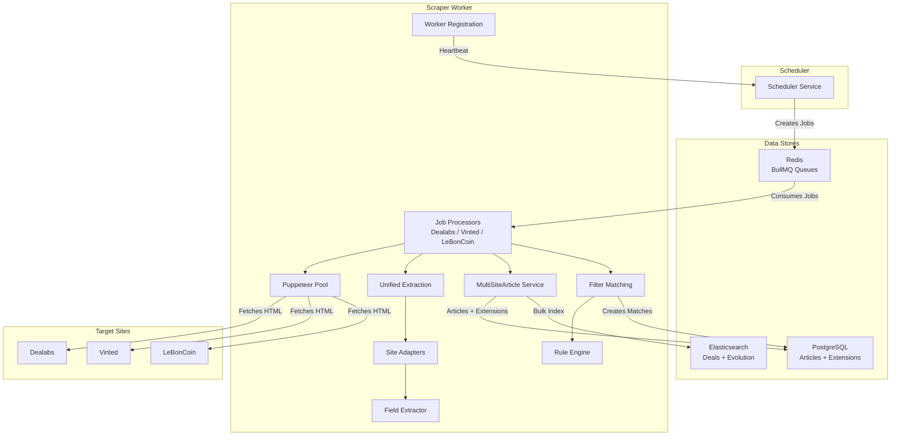

# Scraper Service - Multi-Site Deal Extraction Engine

## Overview

The Scraper Service is the **deal extraction workhorse** of DealsScapper. It consumes scraping jobs from Redis/BullMQ queues dispatched by the Scheduler, fetches web pages using a managed Puppeteer browser pool, extracts structured deal data through site-specific adapters, persists articles to PostgreSQL with site-specific extension tables, indexes them to Elasticsearch, and evaluates them against user-defined filters to create matches.

**Key Responsibilities:**
- **Job Processing** - Consumes `scrape` and `discovery` jobs from per-site BullMQ queues (Dealabs, Vinted, LeBonCoin)
- **Browser Pool Management** - Maintains a pool of stealth-enabled Puppeteer browser instances with memory pressure monitoring, health checks, and automatic recycling
- **Multi-Site Extraction** - Extracts listings through site-specific adapters that produce a unified `UniversalListing` format via Cheerio HTML parsing
- **Article Persistence** - Stores base articles and site-specific extension tables (ArticleDealabs, ArticleVinted, ArticleLeBonCoin) in PostgreSQL transactions
- **Elasticsearch Indexing** - Dual-index architecture for deal deduplication (immutable index) and evolution tracking (time-series)
- **Filter Matching** - Evaluates scraped articles against user-defined filter expressions using a rule engine with 27+ operators, creating matches for qualifying deals
- **Worker Registration** - Self-registers with the Scheduler via heartbeat protocol and unregisters on shutdown

## Architecture

### Service Interactions



### Directory Structure

```
apps/scraper/
├── src/
│   ├── adapters/                  # Site-specific extraction adapters (Dealabs, Vinted, LeBonCoin)
│   │   ├── base/                  # ISiteAdapter interface & IUrlOptimizer interface
│   │   ├── dealabs/               # Dealabs adapter, field config, transformers, URL optimizer
│   │   ├── vinted/                # Vinted adapter, field config, transformers
│   │   └── leboncoin/             # LeBonCoin adapter, field config, transformers
│   ├── category-discovery/        # Category discovery adapters per site
│   ├── common/                    # Shared utilities (DealProcessingUtils, DTOs)
│   ├── config/                    # Logging configuration
│   ├── elasticsearch/             # Dual-index ES services, mappings, config, types
│   ├── extraction/                # UnifiedExtractionService (adapter-agnostic scraping)
│   ├── field-extraction/          # Generic Cheerio-based field extractor with config-driven mapping
│   ├── filter-matching/           # FilterMatchingService, RuleEngineService, interfaces
│   ├── health/                    # ScraperHealthService (pool + DB checks)
│   ├── job-processor/             # BullMQ processors per site + dynamic module registration
│   ├── notification/              # NotificationService (queues to notifier via BullMQ)
│   ├── puppeteer-pool/            # Browser pool, controller, cookie filter service
│   ├── repositories/              # Article, Category, Filter, Match, Notification, ScrapingJob
│   ├── services/                  # DealPersistence, FilterEvaluation, MultiSiteArticle, ScheduledJob
│   ├── shared/                    # SharedModule for cross-cutting providers
│   ├── types/                     # Worker types, filter types, user-agent declarations
│   ├── url-optimization/          # UrlFilterOptimizerService (filter constraints to URL params)
│   ├── utils/                     # Security utilities (sanitizeText, validatePrice)
│   ├── worker-registration/       # WorkerRegistrationService (scheduler heartbeat)
│   ├── main.ts                    # Bootstrap: Puppeteer init, Redis validation, Swagger, worker registration
│   └── scraper.module.ts          # Root NestJS module
├── test/
│   ├── fixtures/                  # HTML fixtures for test mode
│   └── unit/                      # Unit tests per module
└── README.md
```

---

## Internal Services

### PuppeteerPoolService (`puppeteer-pool/puppeteer-pool.service.ts`)

The PuppeteerPoolService manages a pool of headless Chromium browser instances using `puppeteer-extra` with the Stealth plugin for anti-detection. On initialization, it pre-warms the pool with `minInstances` (defaults to `min(2, maxInstances)`) browser instances and runs a health check scheduler every 60 seconds that evaluates instance age, use count, and disconnection status. The pool supports a configurable maximum instance count via `PUPPETEER_MAX_INSTANCES` and enforces a memory threshold at 80% of `WORKER_MAX_MEMORY_MB` -- when memory pressure is detected, new browser creation is deferred and requests are queued instead. The `fetchPage()` method provides a high-level API that handles acquire, navigation with `networkidle2`, cookie/consent element removal via `CookieFilterService` selectors, human-like random delays (300-800ms pre-nav, 500-1500ms post-nav), and automatic release. In test mode (`NODE_ENV=test`), `fetchPage()` returns content from local HTML fixtures instead of hitting real websites, mapping URLs to fixture files by site and category slug.

**Key behaviors:**
- `acquire()` returns an available instance, creates one if under capacity and memory allows, or enqueues with a 60-second timeout
- `release()` evaluates whether to recycle the instance based on `maxUseCount` (50) and `maxAgeMs` (30 minutes)
- Browser launch uses `--no-sandbox`, `--disable-setuid-sandbox`, `--disable-dev-shm-usage` for Docker compatibility
- Anti-detection: `--disable-blink-features=AutomationControlled`, Stealth plugin with all evasions
- Tracks pool statistics: total/available/busy instances, queue length, success/failure rates, average wait time, memory usage
- Disconnection history is tracked (last 50 events) for pattern analysis
- Resource blocking statistics for images, fonts, and analytics

**Depends on:** `SharedConfigService`, `CookieFilterService`

---

### CookieFilterService (`puppeteer-pool/cookie-filter.service.ts`)

The CookieFilterService downloads and parses the Fanboy Cookie Monster adblock filter list to extract CSS selectors for cookie/GDPR consent elements. On module initialization, it checks for a locally cached version in `data/cookie-filter-selectors.json` (7-day TTL) and either loads from cache or fetches the list from `https://www.fanboy.co.nz/fanboy-cookiemonster.txt`. The parser extracts cosmetic filter rules (lines containing `##`), strips site-specific prefixes, and filters out extended CSS pseudo-selectors (`:has-text`, `:matches-css`, etc.) and overly broad selectors (`body`, `html`, `[role="dialog"]`, `.modal-dialog`). Additional common consent provider selectors are appended (Didomi, OneTrust, CookieBot, Tarteaucitron, Axeptio). These selectors are used by PuppeteerPoolService to remove consent elements from the DOM before extracting page content.

**Key behaviors:**
- Fetches filter list with 30-second timeout via HTTPS
- Caches both raw list and parsed selectors to `data/` directory
- Skips comment lines, network rules, exception rules (`#@#`), and procedural filters
- Returns empty array if loading fails (graceful degradation)

**Depends on:** (none -- standalone service)

---

### DealabsScrapeProcessor / VintedScrapeProcessor / LeBonCoinScrapeProcessor (`job-processor/multi-site-scrape.processor.ts`)

Three structurally identical BullMQ processors, each bound to a site-specific queue via `@Processor(getSiteQueueName(SiteSource.XXX))`. Each processor handles two job types: `@Process('scrape')` for category scraping and `@Process('discovery')` for category discovery. The scrape flow fetches HTML via `PuppeteerPoolService.fetchPage()`, extracts listings through `UnifiedExtractionService.scrapeCategoryFromHtml()` using the appropriate site adapter, persists articles with extensions via `MultiSiteArticleService.createManyFromListings()`, and runs filter matching on all articles (both new and existing) via `FilterMatchingService.processFreshDeals()`. The discovery flow uses the `CategoryDiscoveryAdapterRegistry` to discover categories for the site and upserts them via `CategoryRepository`. Job data includes `optimizedQuery` from the scheduler's URL filter optimization, which is appended to the category URL via `applyOptimizedQuery()`.

**Key behaviors:**
- `resolveSiteId()` handles compatibility with both direct job creation (`siteId`) and scheduler dispatch (`source`, `metadata.siteId`)
- Returns structured `ProcessResult` with success status, article count, page count, duration, and indexed count
- Error handling returns a failure result rather than throwing, preserving BullMQ job lifecycle
- Default `maxPages` is 5, configurable per job via `job.data.maxPages`
- Queue registration is dynamic via `JobProcessorModule.register()` based on `SCRAPER_SITE` env var (single-site or multi-site mode)

**Depends on:** `AdapterRegistry`, `UnifiedExtractionService`, `MultiSiteArticleService`, `PuppeteerPoolService`, `FilterMatchingService`, `CategoryDiscoveryAdapterRegistry`, `CategoryRepository`

---

### AdapterRegistry (`adapters/adapter.registry.ts`)

The AdapterRegistry is a factory/registry that provides centralized access to all site adapters (Dealabs, Vinted, LeBonCoin). It registers adapters in the constructor and exposes `getAdapter(siteId)` which throws if the adapter is not found, `getAllAdapters()`, `getAllSiteIds()`, `hasAdapter()`, and `getSiteMetadata()` for frontend display (site name, color code, base URL, URL optimization support). Each adapter implements the `ISiteAdapter` interface with methods for `extractListings()`, `buildCategoryUrl()`, `extractCategorySlug()`, `extractElementCount()`, `getListingSelector()`, and `validateHtml()`.

**Key behaviors:**
- Currently registers three adapters: Dealabs, Vinted, LeBonCoin
- Logs all registered adapters on startup
- Site metadata includes `colorCode` (hex) and `supportsUrlOptimization` flag
- Dealabs adapter includes a `DealabsUrlOptimizer` (the only adapter with URL optimization)

**Depends on:** `DealabsAdapter`, `VintedAdapter`, `LeBonCoinAdapter`

---

### UnifiedExtractionService (`extraction/unified-extraction.service.ts`)

The UnifiedExtractionService provides adapter-agnostic HTML extraction logic. Its primary method `scrapeCategoryFromHtml()` takes any `ISiteAdapter`, a category slug, raw HTML, and extraction options, then delegates to the adapter's `extractListings()` and `extractElementCount()` methods. It also supports URL optimization by calling the adapter's `urlOptimizer.optimizeUrl()` if filter constraints are provided. The service includes result validation (`validateExtractionResult()`) and statistics calculation (`calculateStatistics()`) for monitoring extraction quality.

**Key behaviors:**
- Single entry point for all site extraction regardless of adapter
- Falls back to base URL if URL optimization fails
- Logs HTML length and stack trace on extraction failure for debugging
- Calculates extraction stats: listing count, images, prices, descriptions, average price

**Depends on:** (none -- receives adapters as parameters)

---

### FieldExtractorService (`field-extraction/field-extractor.service.ts`)

The FieldExtractorService is a generic, config-driven Cheerio-based field extractor used by site adapters. It takes a `CheerioAPI`, a Cheerio element, and a `FieldMappingConfig` dictionary that maps field names to extraction rules (CSS selectors, attribute extraction, text content, regex patterns, custom transforms, parsers, validators, and defaults). Built-in transforms and parsers are registered at construction time. Each field mapping can specify `required: true` to throw on extraction failure or provide a `default` value for optional fields.

**Key behaviors:**
- Supports multiple extraction strategies: CSS selector + attribute, text content, regex, custom transform functions
- Built-in parsers for common types (prices, dates, numbers, booleans)
- Input sanitization via `sanitizeText()` and price validation via `validatePrice()`
- Used by Dealabs, Vinted, and LeBonCoin adapters via their `FieldMappingConfig` definitions

**Depends on:** (none -- standalone service)

---

### MultiSiteArticleService (`services/multi-site-article.service.ts`)

The MultiSiteArticleService bridges the gap between adapter output (`UniversalListing`) and the database schema. It creates Article records plus site-specific extension records (ArticleDealabs, ArticleVinted, or ArticleLeBonCoin) within a Prisma transaction, then indexes the article to Elasticsearch via `ElasticsearchIndexerService`. The `createManyFromListings()` method processes listings sequentially, checking for existing articles by `siteId + externalId` compound unique key before creation, and handles P2002 (unique constraint violation) race conditions from concurrent jobs by fetching the existing article. After creation, it performs bulk Elasticsearch indexing using `ArticleWrapper.loadMany()` to include extension data.

**Key behaviors:**
- `createFromListing()` wraps article + extension creation in a `$transaction`
- `createManyFromListings()` returns `BulkCreationResult` with `created`, `existing` (for filter matching), `indexed`, `skipped`, and `errors`
- `upsertFromListing()` supports create-or-update with extension updates
- Handles P2002 race conditions gracefully by fetching the existing record
- Elasticsearch indexing failures are logged but do not block persistence

**Depends on:** `PrismaService`, `ElasticsearchIndexerService`

---

### FilterMatchingService (`filter-matching/filter-matching.service.ts`)

The FilterMatchingService orchestrates evaluation of scraped articles against user-defined filters. The entry point `processFreshDeals()` groups deals by `categoryId`, fetches active filters linked to each category via `FilterRepository.findActiveByCategoryId()`, loads `ArticleWrapper`s with site-specific extension data for accurate evaluation, and evaluates each article against all category filters in parallel. Matches are created in bulk via `MatchRepository.createManyMatches()`. Notifications are not handled here -- they are managed by the scheduler.

**Key behaviors:**
- Groups deals by category to optimize filter queries (only evaluates filters linked to the deal's category)
- Loads `ArticleWrapper`s for full site-specific extension data; falls back to base Article processing if loading fails
- Evaluates all filters in parallel per deal via `Promise.all`
- Delegates pure evaluation logic to `FilterEvaluationService`
- Creates matches with `filterId`, `articleId`, `score`, and `notified: false`

**Depends on:** `FilterRepository`, `MatchRepository`, `CategoryRepository`, `FilterEvaluationService`, `PrismaService`

---

### FilterEvaluationService (`services/filter-evaluation.service.ts`)

The FilterEvaluationService is a pure business logic service containing no database access or side effects. It evaluates filter expressions against `RawDeal` objects by delegating to the `RuleEngineService`, and returns `FilterEvaluationResult` with `matches`, `score`, and human-readable `reasons`. It also provides `analyzeFiltersForOptimization()` which extracts URL-applicable constraints (price ranges, temperature thresholds, title regex patterns) from filter rule trees for URL optimization by the scheduler.

**Key behaviors:**
- `evaluateFilter()` converts DB filter expression via `convertFilterExpressionFromDb()`, delegates to `RuleEngineService`, and flattens detail reasons
- `evaluateFilterAgainstMultipleDeals()` evaluates a single filter against multiple deals in parallel
- `findMatchingDeals()` returns deals matching any of the provided filters
- `analyzeFiltersForOptimization()` recursively extracts price, heat, and title constraints from rule trees
- Returns `{ matches: false, score: 0 }` on evaluation errors (fail-safe)

**Depends on:** `RuleEngineService`

---

### RuleEngineService (`filter-matching/rule-engine.service.ts`)

The RuleEngineService is the core evaluation engine that processes `RuleBasedFilterExpression` trees against `RawDeal` data. It supports 27+ operators across numeric (`=`, `!=`, `>`, `>=`, `<`, `<=`), string (`CONTAINS`, `NOT_CONTAINS`, `STARTS_WITH`, `ENDS_WITH`, `REGEX`, `NOT_REGEX`), array (`IN`, `NOT_IN`, `INCLUDES_ANY`, `INCLUDES_ALL`, `NOT_INCLUDES_ANY`), boolean (`IS_TRUE`, `IS_FALSE`), range (`BETWEEN`), and date (`BEFORE`, `AFTER`, `OLDER_THAN`, `NEWER_THAN`) categories. Rules are organized in groups with logical operators (`AND`, `OR`, `NOT`), and scoring uses configurable modes (`weighted`, `percentage`, `points`) with a minimum score threshold (default 50). Computed fields include `age` (hours since `publishedAt`), `discountPercent`, and `brand` (extracted via regex from title).

**Key behaviors:**
- `evaluateFilterExpression()` processes all rules, applies match logic, calculates score, and checks threshold
- Each rule scores `weight * 100` points on match (default weight 1.0)
- String operations are case-insensitive by default (`caseSensitive` opt-in)
- Regex evaluation is wrapped in try/catch to handle invalid patterns
- Generates human-readable reasons like `"Temperature >= 100 => 250"`
- Empty expressions match everything with score 100

**Depends on:** (none -- standalone service)

---

### DealElasticSearchService (`elasticsearch/services/deal-elasticsearch.service.ts`)

The DealElasticSearchService manages a dual-index Elasticsearch architecture: an immutable deals index for deduplication and a time-series evolution index for tracking deal state changes. On module init, it creates index templates and ensures both indices exist with proper mappings and aliases. The `processBatchedDeals()` method separates new deals from existing ones, indexes new deals in bulk, and tracks evolution (temperature, comment count, vote count, active/expired status) for existing deals only when significant changes are detected. It provides `getTemperatureEvolution()` for UI tooltips with trend analysis (rising/falling/stable) and 24-hour change calculation.

**Key behaviors:**
- `checkExistingDeals()` uses terms aggregation for fast batch existence checks
- `hasSignificantChanges()` compares temperature, commentCount, voteCount, isExpired, isActive
- Expired deals are skipped during evolution tracking
- Health status reports per-index health (green/yellow/red) and document counts
- All ES operations use configurable timeouts and bulk request limits
- Graceful degradation -- initialization failures don't prevent service startup

**Depends on:** `ElasticsearchService` (from `@nestjs/elasticsearch`)

---

### ElasticsearchIndexerService (`elasticsearch/services/elasticsearch-indexer.service.ts`)

The ElasticsearchIndexerService handles article indexing to a flattened `articles` Elasticsearch index. It flattens `ArticleWrapper` objects into documents with site-prefixed fields (`dealabs_temperature`, `vinted_favoriteCount`, `leboncoin_city`, etc.) for unified querying across all sites. It supports single article indexing, bulk indexing, deletion, and full-text search with site-specific filtering. The `buildFilterExpressionQuery()` method converts `RuleBasedFilterExpression` trees to Elasticsearch query DSL, mapping all 27+ operators and handling recursive rule groups with AND/OR/NOT logic.

**Key behaviors:**
- `indexArticle()` indexes a single article (errors are logged but don't throw)
- `bulkIndex()` indexes multiple articles without forced refresh for performance
- `search()` supports full-text search on title (boosted 2x) and description, site filtering, price ranges, and all site-specific filters
- `mapFieldToEsField()` automatically prefixes site-specific fields and resolves aliases (`heat` -> `dealabs_temperature`, `price` -> `currentPrice`)
- Legacy `FilterExpression` format is supported for backward compatibility

**Depends on:** `ELASTICSEARCH_CLIENT` (injected), `PRISMA_SERVICE` (injected)

---

### WorkerRegistrationService (`worker-registration/worker-registration.service.ts`)

The WorkerRegistrationService handles the lifecycle of this scraper worker's relationship with the Scheduler. On module init, it registers with the scheduler at `SCHEDULER_URL/workers/register` with its `workerId`, `endpoint`, optional `site` (from `SCRAPER_SITE` env var), and capacity information (`maxConcurrentJobs`, `maxMemoryMB`, supported job types). It then starts a heartbeat interval every 30 seconds that sends current load status. If the scheduler responds with 401 (worker not registered), it automatically re-registers. On shutdown, it unregisters from the scheduler. Registration failure after max retry attempts (with exponential backoff) causes the process to exit, as the worker cannot function without scheduler integration.

**Key behaviors:**
- Registration retries with exponential backoff (5s initial delay, max attempts from config)
- Heartbeat every 30 seconds with `workerId`, `currentLoad`, and `status: 'active'`
- Auto re-registration on 401 heartbeat response
- Graceful shutdown: clears heartbeat interval and sends unregister request
- Capacity declaration: `scrape-category`, `category-discovery`, `manual-category-discovery`

**Depends on:** `SharedConfigService`

---

### NotificationService (`notification/notification.service.ts`)

The NotificationService queues deal match notifications to the external notifier service via a `notifications` BullMQ queue. When a match is created, `queueExternalNotification()` builds a payload with match ID, user ID, filter ID, deal details (title, price, URL, image, score), and a priority level calculated from the match score (>= 80 = HIGH, >= 60 = NORMAL, else LOW). After queuing, it marks the match as notified in the database. Queue job options include exponential backoff retry (3 attempts, 2-second base delay).

**Key behaviors:**
- Priority-based queue routing using `QUEUE_PRIORITIES` mapping
- Match marked as `notified: true` with `notifiedAt` timestamp after successful queue add
- Notification payload includes deal data snapshot (title, price, URL, image, score)
- Extension fields (merchant, temperature, discountPercentage) are not currently loaded from extension tables

**Depends on:** `PrismaService`, `notifications` queue (injected via `@InjectQueue`)

---

### DealPersistenceService (`services/deal-persistence.service.ts`)

The DealPersistenceService consolidates all deal persistence operations and implements an architecture where deals are always stored in Elasticsearch (complete history), then evaluated against category-specific filters, with matches and articles only created in PostgreSQL when a deal qualifies. The `processDealForAllFilters()` method groups deals by category, retrieves category-specific filters, processes each deal against filters, creates matches, creates articles only for deals with matches, and queues notifications. It also detects expired deals by comparing currently extracted external IDs against active articles in the database, marking missing articles as expired.

**Key behaviors:**
- `persistMultipleDeals()` supports configurable options: upsert mode, duplicate checking, filter application
- `markHiddenExpiredDeals()` marks articles as expired when they disappear from scraped pages
- Duplicate detection uses batch `checkExistenceByExternalIds()` via PostgreSQL
- Filter evaluation uses `FilterEvaluationService.findMatchingDeals()` grouped by category
- `dealExists()` checks PostgreSQL first (faster for recent deals), then falls back to Elasticsearch

**Depends on:** `ArticleRepository`, `FilterRepository`, `CategoryRepository`, `FilterEvaluationService`, `MatchRepository`, `DealElasticSearchService`, `NotificationService`

---

### ScraperHealthService (`health/scraper-health.service.ts`)

The ScraperHealthService extends `BaseHealthService` from `@dealscrapper/shared-health` with scraper-specific health checks. It registers two custom dependency checkers: `database` (verifies PostgreSQL connectivity with a 1-second response time threshold) and `puppeteerPool` (reports unhealthy if zero instances, degraded if >80% utilization or >10 queued requests). The custom health data includes pool statistics (instances, utilization, queue), scraping metrics (requests, success/failure counts, avg wait time), and performance rates.

**Key behaviors:**
- Database health check: `SELECT 1` with 1-second response time threshold
- Puppeteer pool health: unhealthy at 0 instances, degraded at >80% utilization or >10 queued requests
- Included in the `/health` endpoint via SharedHealthModule

**Depends on:** `PuppeteerPoolService`, `PrismaService`, `SharedConfigService`

---

### ScheduledJobService (`services/scheduled-job.service.ts`)

The ScheduledJobService updates `ScheduledJob` execution statistics in the database after scraping completion. It calculates a rolling average execution time using the formula `(old_avg * old_count + new_value) / new_count` and increments `totalExecutions` and `successfulRuns` counters.

**Key behaviors:**
- `updateExecutionStats()` updates total executions, successful runs, last execution time, and average execution time
- Rolling average calculation preserves historical performance data

**Depends on:** `PrismaService`

---

### UrlFilterOptimizerService (`url-optimization/url-filter-optimizer.service.ts`)

The UrlFilterOptimizerService analyzes active filters for a category to extract constraints (temperature ranges, price ranges, merchant names) that can be applied as URL query parameters for Dealabs. This reduces the number of irrelevant deals fetched during scraping. It generates optimized URLs with parameters like `temperatureFrom`, `temperatureTo`, `priceFrom`, `priceTo`, and `retailers`. The `calculateOptimizationPotential()` method estimates scraping reduction (0-95%) with confidence levels based on constraint tightness.

**Key behaviors:**
- Extracts conditions from filter expressions (supports both nested and flat formats)
- Consolidates multiple filter constraints into broadest ranges to ensure all filters can match
- Maps merchant names to Dealabs retailer IDs (Amazon, Cdiscount, Fnac, Darty, Boulanger)
- Optimization estimates: temperature >= 200 = 80% reduction, price <= 50 = 70% reduction

**Depends on:** (none -- standalone service)

---

### ArticleRepository (`repositories/article.repository.ts`)

The ArticleRepository extends `AbstractBaseRepository` and provides all article-related database operations. It supports CRUD operations, RawDeal-to-ArticleCreateInput conversion (universal fields only, extension fields handled by MultiSiteArticleService), batch existence checking via `checkExistenceByExternalIds()`, upsert via compound unique key `[siteId, externalId]`, and category auto-creation via `findOrCreateCategoryIdByName()`.

**Key behaviors:**
- `createFromRawDeal()` converts RawDeal to ArticleCreateInput with only universal fields
- `upsertFromRawDeal()` uses compound unique key `siteId_externalId`
- `findOrCreateCategoryIdByName()` auto-generates slug and source URL from site configuration
- `deleteOlderThan()` for article cleanup by age
- Default ordering by `scrapedAt DESC`

**Depends on:** `PrismaService`

---

## Core Features

### 1. Multi-Site Adapter Pattern

Each supported site (Dealabs, Vinted, LeBonCoin) has a dedicated adapter implementing `ISiteAdapter`. Adapters use a config-driven `FieldMappingConfig` that defines CSS selectors, attribute extraction, transforms, and validators for each field. The `FieldExtractorService` generically processes these configs via Cheerio. All adapters produce `UniversalListing` objects with a discriminated `siteSpecificData` union (`DealabsData | VintedData | LeBonCoinData`).

### 2. Dynamic Site-Dedicated or Multi-Site Mode

The `SCRAPER_SITE` environment variable controls whether the worker processes jobs for a single site or all sites. `JobProcessorModule.register()` dynamically registers only the relevant BullMQ queues and processors. In production, multiple single-site workers can be deployed for horizontal scaling.

### 3. Dual Elasticsearch Index Architecture

The service maintains two Elasticsearch indices:
- **Deals Index** (immutable) - One document per unique deal, used for deduplication
- **Evolution Index** (time-series) - Tracks temperature, comment count, vote count, and status changes over time, used for trend analysis and UI tooltips

### 4. Rule-Based Filter Engine

The filter engine supports expressions with nested rule groups (`AND`/`OR`/`NOT`), 27+ operators, weighted scoring with configurable modes (`weighted`/`percentage`/`points`), minimum score thresholds, and computed fields (deal age, discount percentage, brand extraction). Filter evaluation is performed in parallel per article for performance.

### 5. Cookie/Consent Element Removal

The `CookieFilterService` downloads and parses the Fanboy Cookie Monster filter list, extracting CSS selectors for consent popups. These selectors are applied via Puppeteer to remove GDPR consent overlays before page content extraction, preventing them from interfering with deal data extraction.

---

## Tech Stack

| Technology | Purpose |
|---|---|
| NestJS | Application framework and dependency injection |
| Puppeteer (puppeteer-extra + Stealth) | Headless browser automation with anti-detection |
| Cheerio | Server-side HTML parsing and extraction |
| BullMQ (Bull) | Job queue consumption from Redis |
| Elasticsearch | Deal indexing, deduplication, evolution tracking, search |
| Prisma | PostgreSQL ORM for articles, extensions, matches, filters |
| Redis | Queue backend for BullMQ |
| Axios | HTTP client for scheduler registration/heartbeat |
| Swagger | API documentation |

---

## Getting Started

### Prerequisites

- Node.js 20+
- pnpm
- Redis (for BullMQ queues)
- PostgreSQL (for Prisma)
- Elasticsearch (for deal indexing)
- Chromium or Chrome (for Puppeteer)

### Running the Service

```bash
# Development (hot-reload)
pnpm dev:scraper

# Infrastructure first (if not running)
pnpm cli infra start

# Check service health
curl http://localhost:3002/health
```

### Environment Variables

| Variable | Required | Default | Description |
|---|---|---|---|
| `SCRAPER_PORT` | Yes | `3002` | HTTP port |
| `DATABASE_URL` | Yes | - | PostgreSQL connection string |
| `REDIS_HOST` | Yes | `localhost` | Redis host |
| `REDIS_PORT` | Yes | `6379` | Redis port |
| `REDIS_DB` | Yes | `1` | Redis database number |
| `ELASTICSEARCH_NODE` | Yes | `http://localhost:9200` | Elasticsearch URL |
| `PUPPETEER_MAX_INSTANCES` | Yes | `3` | Max browser instances in pool |
| `PUPPETEER_EXECUTABLE_PATH` | No | - | Custom Chrome/Chromium path |
| `WORKER_ID` | Yes | Auto-generated | Unique worker identifier |
| `WORKER_ENDPOINT` | Yes | Auto-generated | Worker HTTP endpoint |
| `WORKER_MAX_CONCURRENT_JOBS` | Yes | `3` | Max concurrent jobs |
| `WORKER_MAX_MEMORY_MB` | Yes | `2048` | Memory limit (pool threshold = 80%) |
| `SCHEDULER_URL` | Yes | `http://localhost:3004` | Scheduler service URL |
| `PAGES_PER_CATEGORY` | Yes | `5` | Default max pages per scrape |
| `SCRAPER_SITE` | No | `all` | Site to process (`dealabs`, `vinted`, `leboncoin`, or `all`) |

---

## API Endpoints

| Method | Path | Description |
|---|---|---|
| `GET` | `/health` | Health check with pool stats, DB status, dependencies |
| `GET` | `/puppeteer-pool/stats` | Detailed Puppeteer pool statistics (instances, queue, memory, performance) |
| `GET` | `/api/docs` | Swagger API documentation |

---

## Testing

### Running Tests

```bash
# All scraper unit tests
pnpm cli test unit --service scraper

# Specific test files
npx jest apps/scraper/test/unit/adapters/vinted.adapter.spec.ts
npx jest apps/scraper/test/unit/filter-matching/rule-engine.service.spec.ts
```

### Test Coverage

| Area | Test Files |
|---|---|
| Adapters | `dealabs.adapter.spec.ts`, `leboncoin.adapter.spec.ts`, `vinted.adapter.spec.ts`, `adapter.registry.spec.ts` |
| Filter Matching | `filter-matching.service.spec.ts`, `filter-matching.service-new.spec.ts`, `rule-engine.service.spec.ts` |
| Notification | `notification.service.spec.ts` |
| Puppeteer Pool | `puppeteer-pool.controller.spec.ts`, `puppeteer-pool.service.spec.ts` |
| Repositories | `scraping-job.repository.spec.ts` |
| Services | `deal-persistence.service.spec.ts`, `multi-site-article.service.spec.ts` |
| URL Optimization | `url-filter-optimizer.service.spec.ts`, `url-filter-optimizer.integration.spec.ts` |

### Test Mode

When `NODE_ENV=test`, the Puppeteer pool returns content from HTML fixture files in `test/fixtures/` instead of fetching real websites. Fixture files are named `{siteId}-{categorySlug}.html` (e.g., `dealabs-accessoires-gaming.html`).

---

## Integration with Other Services

### Scheduler Service
- **Worker Registration**: Scraper registers with scheduler on startup via `POST /workers/register` and sends heartbeats every 30 seconds via `POST /workers/heartbeat`
- **Job Consumption**: Scraper consumes `scrape` and `discovery` jobs from per-site BullMQ queues created by the scheduler
- **Unregistration**: Scraper sends `POST /workers/unregister` on graceful shutdown

### API Service
- **Shared Database**: Both services read/write to the same PostgreSQL database via Prisma (articles, matches, filters, categories)
- **Elasticsearch**: Both services can query the same Elasticsearch indices

### Notifier Service
- **Notification Queue**: Scraper queues `deal-match-found` jobs to the `notifications` BullMQ queue for the notifier to process

---

## Troubleshooting

### Puppeteer fails to launch
- **Symptom**: `Failed to create browser instance` error on startup
- **Solution**: Ensure Chrome/Chromium is installed. In Docker, ensure `--no-sandbox` and `--disable-dev-shm-usage` are set. Set `PUPPETEER_EXECUTABLE_PATH` if Chrome is in a non-standard location.

### Redis connection timeout
- **Symptom**: `Command timed out` errors from Bull queue
- **Solution**: The scraper explicitly excludes `commandTimeout` from Bull's Redis config because Bull uses `BRPOP` (blocking command). Verify Redis is running and accessible at `REDIS_HOST:REDIS_PORT`.

### Worker registration fails
- **Symptom**: `Failed to register worker after N attempts. Exiting process.`
- **Solution**: Ensure the scheduler service is running at `SCHEDULER_URL`. The worker will retry with exponential backoff but exits if all attempts fail.

### Elasticsearch indexing errors
- **Symptom**: `Bulk Elasticsearch indexing failed` or `Failed to initialize articles index` warnings
- **Solution**: The scraper operates with degraded functionality if Elasticsearch is unavailable. Ensure Elasticsearch is running at `ELASTICSEARCH_NODE`. Articles will still be saved to PostgreSQL.

### Memory pressure / no new browser instances
- **Symptom**: `Memory pressure detected - queuing request instead of spawning new browser`
- **Solution**: The pool refuses to create new browsers when RSS memory exceeds 80% of `WORKER_MAX_MEMORY_MB`. Reduce `PUPPETEER_MAX_INSTANCES` or increase `WORKER_MAX_MEMORY_MB`.
